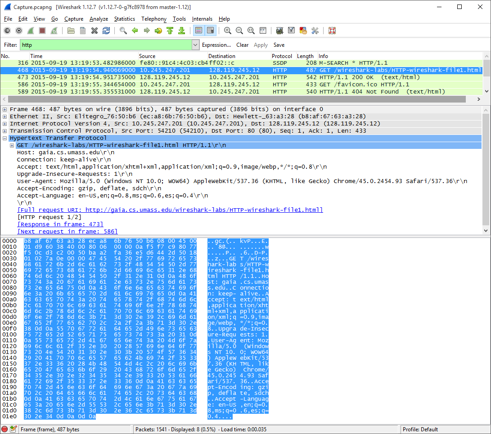
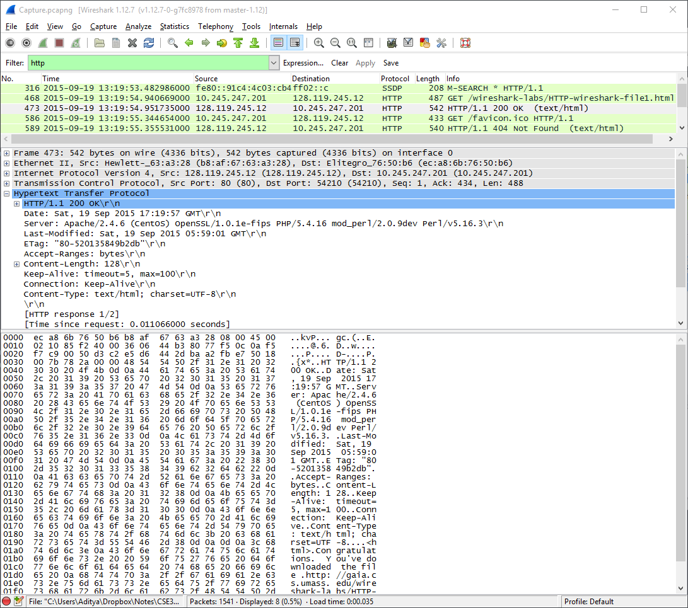
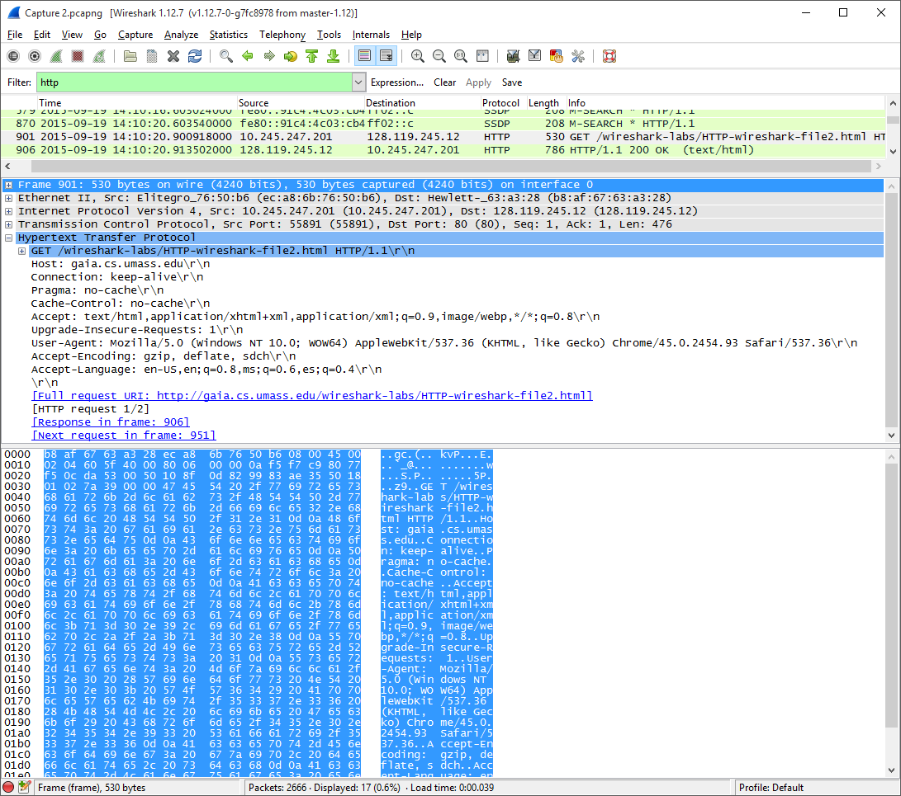
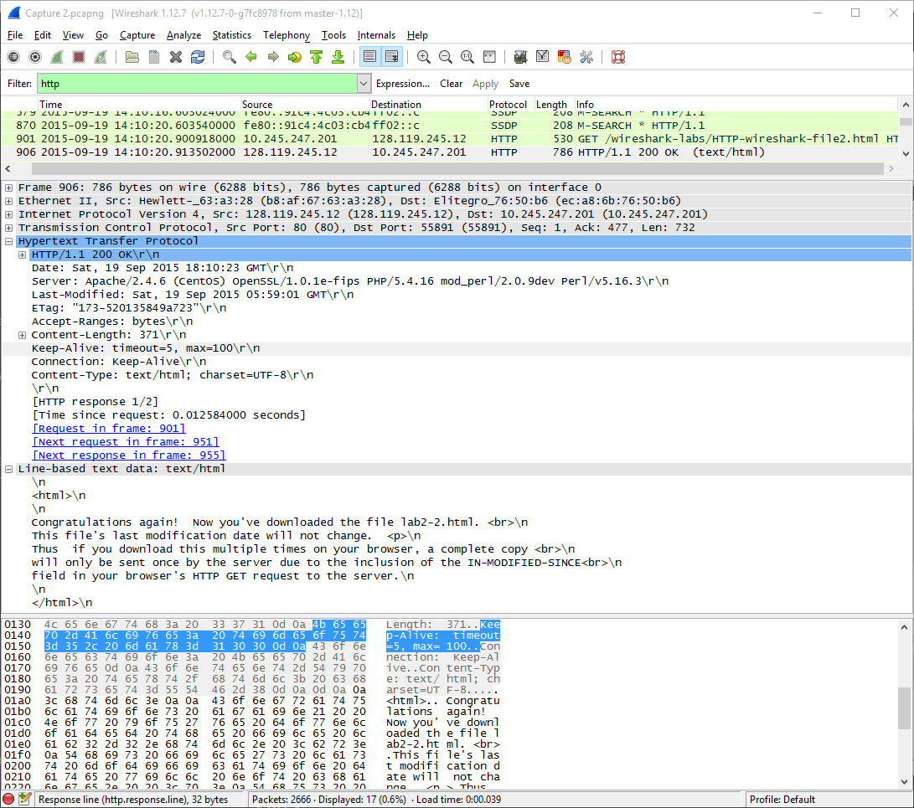
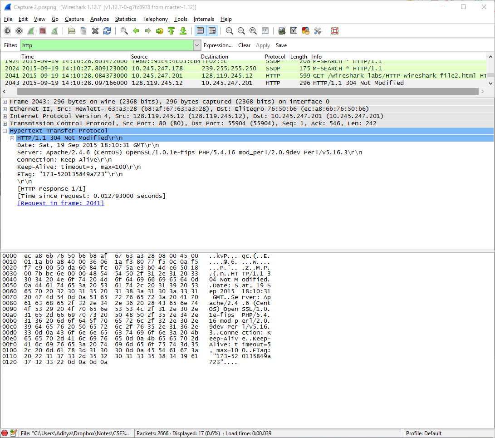
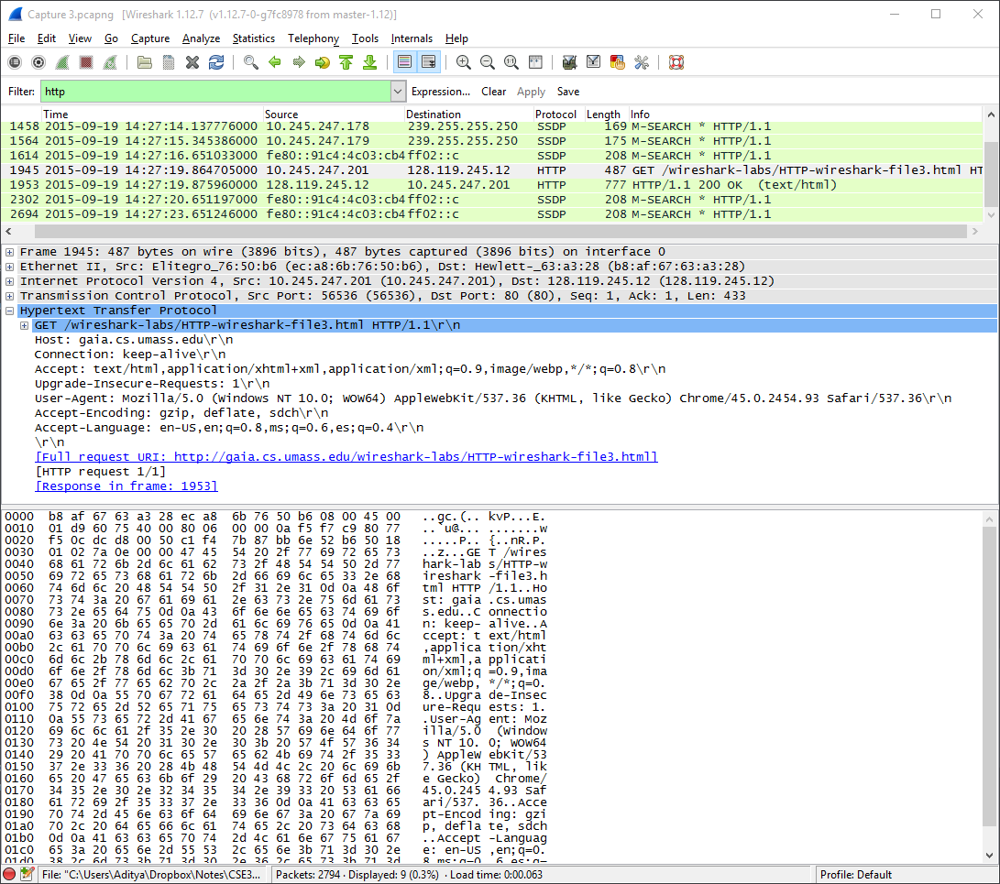
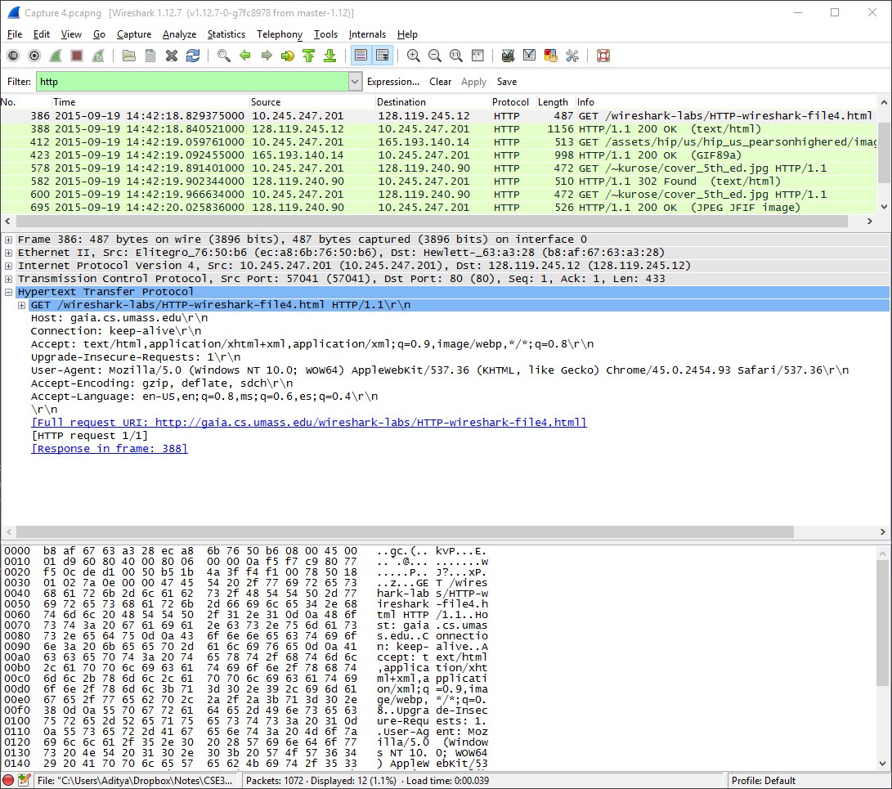
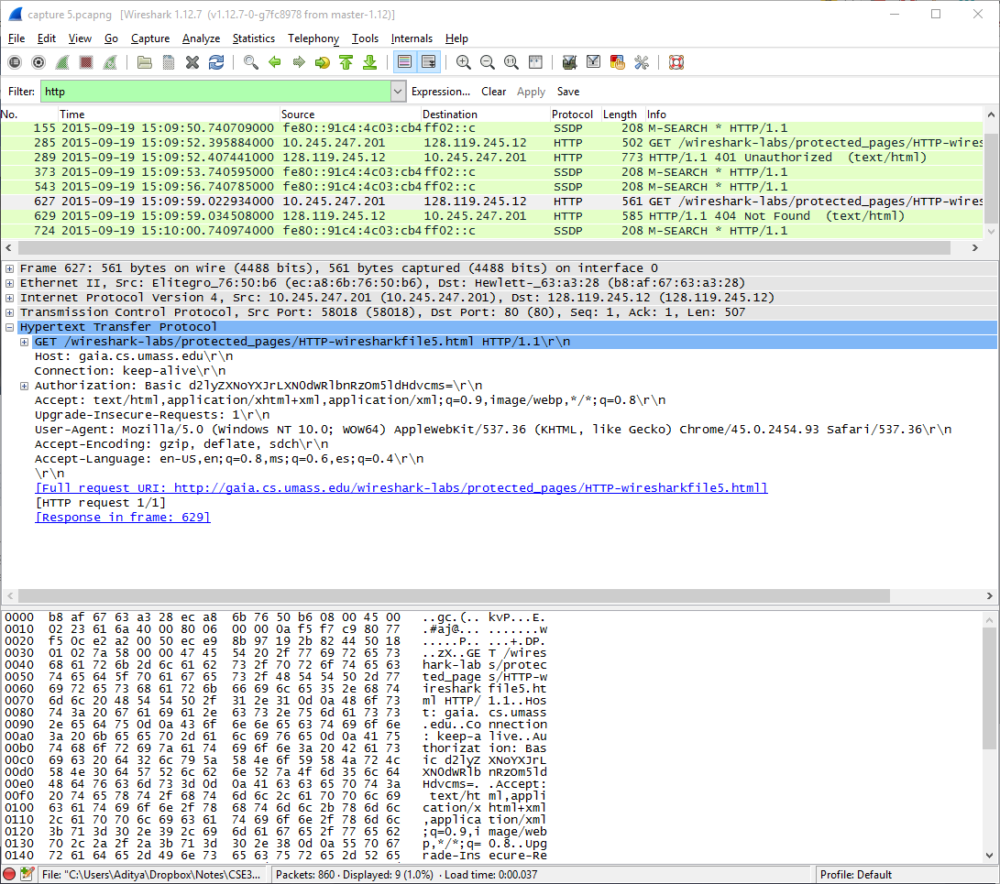
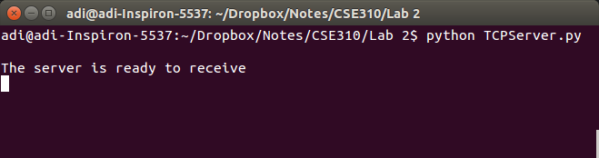
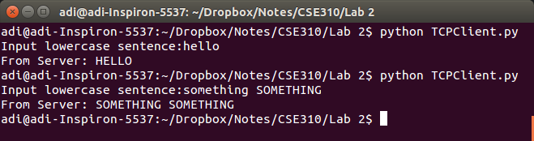

# CSE 307 Lab 2

## Aditya Balwani, SBU ID : 109353920

### I. WireShark HTTP Lab

#### Part 1

1. HTTP 1.1
2. The browser accepts English (US) as mentioned in `Accept-Language: en-US,en;`
3. My IP Address : 10.245.247.201   gaia IP Address : 128.119.245.12
4. The server returns status code 200 which is HTTP OK
5. Last-Modified: Sat, 19 Sep 2015 05:59:01 GMT
6. 128 Bytes
7. No, all the headers are found in the raw data

#### Part 2

8. No, the first one does not have IF-MODIFIED-SINCE
9. Yes the server explicitly returns the content of the file, since its there in the raw data
10. Yes, the second HTTP GET Request contains an IF-MODIFIED-SINCE header, and it contains the date and time of when the page was last modified
11. The server return a 304 NOT MODIFIED, and it did not explicitly return the contents of the file.

#### Part 3

12. The Browser sent 1 HTTP GET request which is packet number 1945
13. Packet number 1953 in the trace contains the status code and phrase associated with the response to the HTTP GET request.
14. Status Code 200, Phrase : HTTP OK
15. 4 TCP Segments

#### Part 4

16. The browser sent 4 HTTP GET Requests  
  1 to 128.119.245.12 for the Wireshark lab webpage  
  1 to 165.193.140.14 for the Pearson Logo  
  2 to 128.119.240.90 for the cover of the 5th Edition of Computer Networking
17. We can tell whether the browser downloaded the images serially or in parallel by looking at the time of the requests. Since the GET for the second request is sent after the first image is already received, we can say that the images were downloaded serially

#### Part 5

18. After the initial request, the server responds with a 401 Unauthorized
19. The second request now contains the "Authorization" field

### II. Python client and server

#### Server

#### Test Cases

