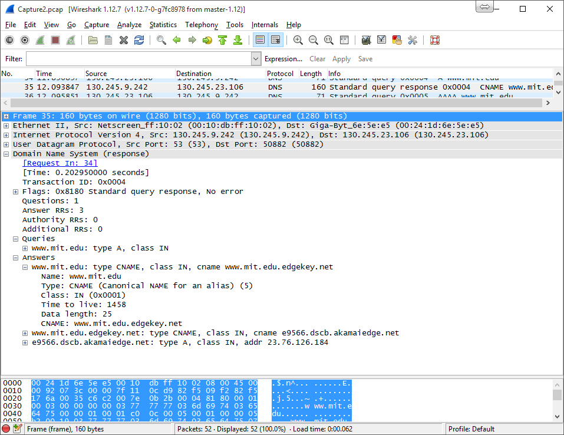

<html>
<head>
<meta charset="UTF-8">
<title>Answers.html</title>
</head>
<body>

<h1>CSE  Lab 3</h1>
<h2>I. WireShark HTTP Lab</h2>
<h2>Aditya Balwani, SBUID : 109353920</h2>
<h3>Part 1</h3>
<ol>
<li><b>Run nslookup to obtain the IP address of a Web server in Asia. What is the IP address of that server?</b>   

  </li>

<li><b>Run nslookup to determine the authoritative DNS servers for a university in Europe.</b>   

</li>
<li><b>Run nslookup so that one of the DNS servers obtained in Question s queried for the mail servers for Yahoo! mail. What is its IP address?</b>   

The IP address is 98.139.21.169

  </li>

<li>

<b>Locate the DNS query and response messages. Are then sent over UDP or TCP?</b>   

The query and response were sent over UDP.

  </li>

<li><b>What is the destination port for the DNS query message? What is the source port of DNS response message?</b>   

The destination port of the request is 53. The source port of the response is 53

  </li>

<li><b>To what IP address is the DNS query message sent? Use ipconfig to determine the IP address of your local DNS server. Are these two IP addresses the same?</b>   

The DNS query message is sent to 130.245.9.242. Yes this is the address of my local DNS Server as seen in ipconfig :  

  </li>

<li><b>Examine the DNS query message. What “Type” of DNS query is it? Does the query message contain any “answers”?</b>   

It is a standard type A query and does not contain any answers

  </li>

<li><b>Examine the DNS response message. How many “answers” are provided? What do each of these answers contain?</b>   

The response contains 3 answers and each one contains the name, the canonical name, time to live and the data length. One of them also the contains an IP address

  </li>

<li><b>Consider the subsequent TCP SYN packet sent by your host. Does the destination IP address of the SYN packet correspond to any of the IP addresses provided in the DNS response message?</b>   

Yes, the destination of the IP Address of th destination corresponds to one of the IPs provided in the answers of the DNS Response

  </li>

<li> <b>This web page contains images. Before retrieving each image, does your host issue new DNS queries?</b>   

No, the host does not issue more DNS queries because the images are hosted at the same domain. If the images were hosted somewhere else then it would issue new DNS queries.

</li>
<li> <b>What is the destination port for the DNS query message? What is the source port of DNS response message?</b>   

The destination port of the request is 53. The source port of the response is 53

  </li>

<li> <b>To what IP address is the DNS query message sent? Is this the IP address of your default local DNS server?</b>   

The DNS query message is sent to 130.245.9.242. Yes this is the address of my local DNS Server as seen in ipconfig :  

  </li>

<li> <b>Examine the DNS query message. What “Type” of DNS query is it? Does the query message contain any “answers”?</b>   

It is a type A query and doesn't contain any answers.

  </li>

<li> <b>Examine the DNS response message. How many “answers” are provided? What do each of these answers contain?</b>   

The response contains 3 answers and each one contains the name, the canonical name, time to live and the data length. One of them also the contains an IP address

  </li>

<li>
<b>Provide a screenshot. (indicating query and response messages)</b>   

  

  </li>
<li>
<b>To what IP address is the DNS query message sent? Is this the IP address of your default local DNS server?</b>   

The DNS query message is sent to 130.245.9.242. Yes this is the address of my local DNS Server as seen in ipconfig :  

  </li>

<li> <b>Examine the DNS query message. What “Type” of DNS query is it? Does the query message contain any “answers”?</b>   

It is an NS Type query, and it does not contain any answers

  </li>

<li> <b>Examine the DNS response message. What MIT nameservers does the response message provide? Does this response message also provide the IP addresses of the MIT namesers?</b>   

The reponse provides 2 name servers which are www.mit.edu.edgekey.net and e9566.dscb.akamaiedge.net. No it does not provide the IP address for the nameservers.

  </li>

<li>

<b>Provide a screenshot. Indicate query and response messages</b>   

  </li>

<li><b>To what IP address is the DNS query message sent? Is this the IP address of your default local DNS server? If not, what does the IP address correspond to?</b>   

NOTE : Using the university of Seoul National University domain which is www.snu.ac.kr and using Google DNS (8.8.8.8) as the DNS server

The DNS Query is sent to 8.8.8.8 which corresponds to Google's DNS. No this is not the default dns.

  </li>

<li> <b>Examine the DNS query message. What “Type” of DNS query is it? Does the query message contain any “answers”?</b>   

It is a standard type A query and does not contain any answers.

  </li>

<li> <b>Examine the DNS response message. How many “answers” are provided? What does each of these answers contain?</b>   

There are 2 answers provided the first one is the canonical name and the second has the address.

  </li>

<li> <b>Provide a screenshot. Indicate query and response messages</b>

  </ol>

</body>
</html>
