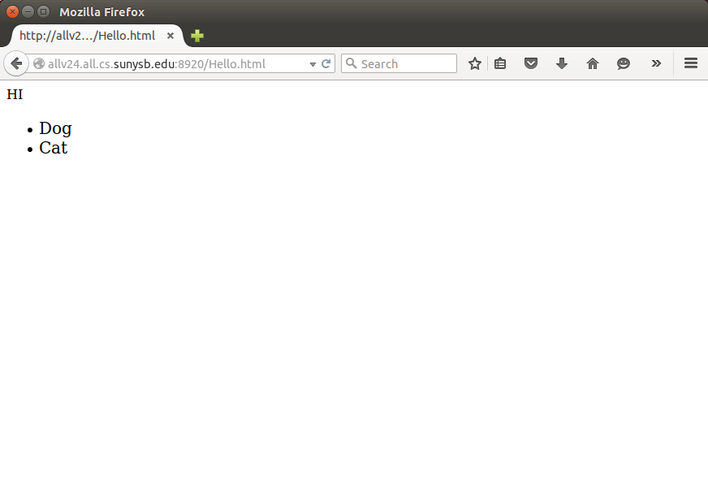
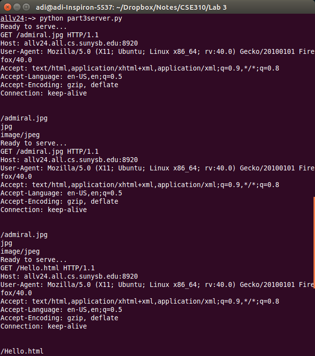

### Part 2

#### Documentation

This is a simple HTTP server written in python. It can handle files of type html, rawtext, jpeg and pngs. To execute the server, simply run `python part3server.py` on an allv machine and then visit [http://allv24.all.cs.stonybrook.edu:8920/Hello.html]()

#### Server code :

```python
# pylint: disable=W,C

#Aditya Balwani, SBU ID : 109353920

#import socket module
from socket import *
#Set port number to 8920
serverPort = 8920
serverSocket= socket(AF_INET, SOCK_STREAM)
#Prepare a sever socket, bind port
serverSocket.bind(('',serverPort))
serverSocket.listen(1)
while True:
    #Establish the connection
    print 'Ready to serve...'

    #Accept a request from a host
    connectionSocket, addr = serverSocket.accept()
    try:
        #On request recieved, parse the message
        message = connectionSocket.recv(2048)
        print message

        #Extract the filename and the filetype
        filename = message.split()[1]
        print filename

        fileType = filename.split(".")[1].lower()
        print fileType

        #Read file type
        f = open(filename[1:],"r")
        outputdata = f.read()

        # Check file types, and define content type header
        if fileType == 'jpg' or fileType == 'jpeg':
            contentType = 'image/jpeg'
        elif fileType == 'png':
            contentType = 'image/png'
        elif fileType == 'html':
            contentType = 'text/html'
        else:
            contentType = 'text/plain'

        print contentType

        # Send HTTP OK
        connectionSocket.send("HTTP/1.1 200 OK\r\nContent-Type: "+contentType+"; charset=utf-8\r\n\r\n")

        #Send the content of the requested file to the client
        for line in outputdata:
            #print line
            connectionSocket.send(line)
        connectionSocket.close()
    except IOError:
        #Sendresponse message for file not found
        connectionSocket.send("HTTP/1.1 404 NOT FOUND\r\nContent-Type: text/html; charset=utf-8\r\n\r\n")

        # Send a 404 page
        connectionSocket.send("<html><head><title>Hi</title></head><body><h1>404 NOT FOUND</h1></body></html>")
        #Close client socket

        connectionSocket.close()

serverSocket.close()

```

<div class="page-break"></div>

#### Screenshots



