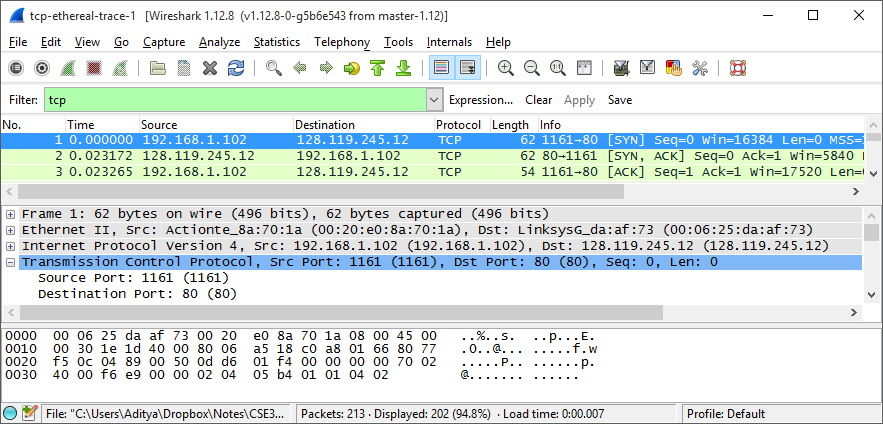

# CSE  Lab 4
## WireShark TCP Lab
## Aditya Balwani, SBUID : 109353920
### Part 1

1.	**What is the IP address and TCP port number used by the client computer (source) that is transferring the file to gaia.cs.umass.edu?**

  The client computer is 192.168.1.102 and uses the TCP port 1161<br/><br/><br/>

2.	**What is the IP address of gaia.cs.umass.edu? On what port number is it sending and receiving TCP segments for this connection?**

  The IP address of gaia.cs.umass.edu is 128.119.249.12 and is sending and receiving TCP segments on port 80.<br/><br/>

  

  <div class="page-break"></div>


3.	**What is the IP address and TCP port number used by your client computer (source) to transfer the file to gaia.cs.umass.edu?**

  The client computer is 130.245.9.251 and is using port number 49209<br/><br/><br/>

4.	**What is the sequence number of the TCP SYN segment that is used to initiate the TCP connection between the client computer and gaia.cs.umass.edu? What is it in the segment that identifies the segment as a SYN segment?**

  The sequence number of the TCP SYN segment is 0. We can tell its a SYN segment by looking at its flag where the second bit represents Syn and it is set.<br/><br/>

  

  <div class="page-break"></div>

5.	**What is the sequence number of the SYNACK segment sent by gaia.cs.umass.edu to the client computer in reply to the SYN? What is the value of the Acknowledgement field in the SYNACK segment? How did gaia.cs.umass.edu determine that value? What is it in the segment that identifies the segment as a SYNACK segment?**

  The sequence number of the TCP SYNACK segment is 0. The value of the Acknowledgement Number is 1. The value is determined by adding one to the SYN segment that the client sent to gaia. It is identified as a SYNACK as both the the SYN and the ACK bits in the flags are set.<br/><br/>

  

  <div class="page-break"></div>

6.	**What is the sequence number of the TCP segment containing the HTTP POST command? Note that in order to find the POST command, you’ll need to dig into the packet content field at the bottom of the Wireshark window, looking for a segment with a “POST” within its DATA field.**

  The sequence number of the TCP segment containing the HTTP POST command is 145190.<br/><br/>

7.	**Consider the TCP segment containing the HTTP POST as the first segment in the TCP connection. What are the sequence numbers of the first six segments in the TCP connection (including the segment containing the HTTP POST)? At what time was each segment sent? When was the ACK for each segment received? Given the difference between when each TCP segment was sent, and when its acknowledgement was received, what is the RTT value for each of the six segments? What is the EstimatedRTT value (see Section 3.5.3, page 239 in text) after the receipt of each ACK? Assume that the value of the EstimatedRTT is equal to the measured RTT for the first segment, and then is computed using the EstimatedRTT equation on page 239 for all subsequent segments.
Note: Wireshark has a nice feature that allows you to plot the RTT for each of the TCP segments sent. Select a TCP segment in the “listing of captured packets” window that is being sent from the client to the gaia.cs.umass.edu server. Then select: Statistics->TCP Stream Graph- >Round Trip Time Graph.**

  The HTTP Post is considered the first segment. Segments 1 - 6 are 176, 250, 254, 259, 264 and 270 and the corresponding ACKS are 6, 9, 14, 15, 16, 17

  Estimated RTT = 0.875 \* EstimatedRTT + 0.125 \* SampleRTT

  <table>
    <tr>
      <th>Num</td>
      <th>Seq. Number</td>
      <th>Length (bytes)</td>
      <th>Time Sent</td>
      <th>Time Ack Recieved</td>
      <th>RTT (s)</td>
      <th>EstimatedRTT (s)</td>
    </tr>
    <tr>
      <td>1</td>
      <td>1</td>
      <td>5840</td>
      <td>1.509094</td>
      <td>1.52552</td>
      <td>0.016426</td>
      <td>0.016426</td>
    </tr>
    <tr>
      <td>2</td>
      <td>5841</td>
      <td>11680</td>
      <td>1.52556</td>
      <td>1.536058</td>
      <td>0.010498</td>
      <td>0.016426</td>
    </tr>
    <tr>
      <td>3</td>
      <td>17521</td>
      <td>23360</td>
      <td>1.536111</td>
      <td>1.547570</td>
      <td>0.011459</td>
      <td>0.015685</td>
    </tr>
    <tr>
      <td>4</td>
      <td>40881</td>
      <td>39474</td>
      <td>1.547656</td>
      <td>1.558070</td>
      <td>0.010414</td>
      <td>0.01515675</td>
    </tr>
    <tr>
      <td>5</td>
      <td>80301</td>
      <td>4434</td>
      <td>1.558109</td>
      <td>1.558569</td>
      <td>0.00046</td>
      <td>0.014563</td>
    </tr>
    <tr>
      <td>6</td>
      <td>84681</td>
      <td>54020</td>
      <td>1.558634</td>
      <td>1.568623</td>
      <td>0.009989</td>
      <td>0.0128001</td>
    </tr>
  </table><br/><br/><br/>

8.	**What is the length of each of the first six TCP segments?**

  Segment 1 : 5840 bytes<br/>
  Segment 2 : 11680 bytes<br/>
  Segment 3 : 23360 bytes<br/>
  Segment 4 : 39474 bytes<br/>
  Segment 5 : 4434 bytes<br/>
  Segment 6 : 54020 bytes<br/><br/><br/>

  

9.	**What is the minimum amount of available buffer space advertised at the received for the entire trace? Does the lack of receiver buffer space ever throttle the sender?**

  The minimum amount of available buffer space advertised at the beginning is 14600 bytes. The lack of reciever buffer space never throttles the user because it never reaches the maximum<br/><br/><br/>

  <div class="page-break"></div>

10.	**Are there any retransmitted segments in the trace file? What did you check for (in the trace) in order to answer this question?**

  No there are no retransmitted segments in this trace file. To check this we check the TCP Time Graph (Stevens). As we can see from the graph, the sequence numbers steadily increase and no sequence number is repeated so no segment is repeated<br/><br/>

  

  <div class="page-break"></div>

11.	**How much data does the receiver typically acknowledge in an ACK? Can you identify cases where the receiver is ACKing every other received segment (see Table 3.2 on page 247 in the text)**

  The receiver typically acknowledges 1460 bytes in an ACK.

  In our data we never see the situation where every other segment is acked however that is because our data segments are displayed as a few big segnments in Wireshark when in reality is a bunch of smaller segments, so we see a lot more acks. <br/><br/>

  

  <div class="page-break"></div>

12.	**What is the throughput (bytes transferred per unit time) for the TCP connection?
Explain how you calculated this value.**

  To calculate the throughput we need the total number of bytes transferred which we can get by looking at the difference between the sequence numbers between the first and last segments and then we divide that with the total time which is the time difference between the first and last segment. <br/>
  The total size is : 152840 - 1 = 152839 bytes
  Total time is : 1.580070 - 1.509094 = 0.070976s

  Throughput  is then 2.05 MBps<br/><br/><br/>

13.	**Use the Time-Sequence-Graph(Stevens) plotting tool to view the sequence number versus time plot of segments being sent from the client to the gaia.cs.umass.edu server. Can you identify where TCP’s slowstart phase begins and ends, and where congestion avoidance takes over? Comment on ways in which the measured data differs from the idealized behavior of TCP that we’ve studied in the text.**

  The slowstart phase only lasts for the first 0.1 seconds and after that the congestion control takes over. However its not the linear graph that we expect from ideal data. Instead the segments seem to be transmitted in groups of 5.<br/><br/>

  

14.	**Answer each of two questions above for the trace that you have gathered when you transferred a file from your computer to gaia.cs.umass.edu**

  In case of our data, since the internet is a lot faster, the whole file gets transmitted before the connections leaves the slow-start phase. As a result the whole graph represents the slow-start which again lasts for 0.15s<br/><br/>

  


<div class="page-break"></div>

### Part 2

#### Documentation

This is a simple ping client written to simulate packet loss that takes place over UDP communications. To run this first start the server by running `python Lab4PingServer.py` and then running the client on another machine with the server host address and port number as arguments for example `python Lab4PingClient.py localhost 8920` [http://allv24.all.cs.stonybrook.edu:8920/Hello.html]()

#### Server Code

```python
# pylint: disable=W,C

# UDP Server
import random
from socket import *

serverSocket = socket(AF_INET, SOCK_DGRAM)

serverSocket.bind(('',8920))

while True:
    rand = random.randint(0,10)

    message, address = serverSocket.recvfrom(1024)

    message.upper()

    if rand < 4:
        continue

    serverSocket.sendto(message, address)

```

#### Client Code

```python
#pylint: disable = W,C

# Aditya Balwani
# SBUID : 109353920
# CSE 310 Lab 4 Python Client

import sys, time
from socket import *
from datetime import datetime

# Get the server hostname and port as command line arguments
argv = sys.argv
host = argv[1]
port = argv[2]

# Create UDP client socket
clientSocket = socket(AF_INET, SOCK_DGRAM)
# Set socket timeout as 1 second
clientSocket.settimeout(2)

# Command line argument is a string, change the port into integer
port = int(port)

print "Pinging " + host+":"+str(port) + " with 10 packets"

# Init initial values
pingMin = 1
pingMax = 0
pingSum = 0
successCount = 0

for seqno in range(0,10):
# Fill in end

    # Format the message to be sent
    data = "Ping " + str(seqno) + " " + time.asctime()

    # Attempt to send and receive
    try:
	    # Record the sent time
        sntTime = time.time()

	    # Send the UDP packet with the ping message
        clientSocket.sendto(data,(host,port))

	    # Receive the server response
        modifiedSentence,sender = clientSocket.recvfrom(1024)
        clientSocket.settimeout(2)

        # Record the received time
        rcvTime = time.time()

        #Do required calculations
        responseTime = rcvTime - sntTime

        if pingMin > responseTime:
            pingMin = responseTime
        if pingMax < responseTime:
            pingMax = responseTime
        successCount += 1
        pingSum += responseTime


	    # Display the server address and server response as an output
        print "\nReply from " + str(sender) + "\nMessage : " + modifiedSentence

	    # Round trip time is the difference between sent and received time
        print "RTT: " + str(rcvTime - sntTime) + " seconds"

    except Exception,err:
        # print(err)
        # Server does not response
	# Assume the packet is lost
        print "\nRequest timed out."

# Close the client socket
clientSocket.close()

# Print statistics
print "\nMinimum Response Time : " + str(pingMin) + " seconds"
print "Maximum Response Time : " + str(pingMax) + " seconds"
print "Average Response Time : " + str(pingSum/successCount) + " seconds"
print "Success Rate : " + str(successCount*10) + "%"

```
