# CSE  Lab 4
## WireShark TCP Lab
## Aditya Balwani, SBUID : 109353920
### Part 1

1.	**What is the IP address of your host? What is the IP address of the destination host?**

  My IP Address is 130.245.23.108. The IP address of the destination host is 143.89.14.2   

2. **Why is it that an ICMP packet does not have source and destination port numbers?**

  The ICMP Packet doesn't have a source and destination port number because it is designed to communicate between the network layer and not the application layer.   

3. **Examine one of the ping request packets sent by your host. What are the ICMP type and code numbers? What other fields does this ICMP packet have? How many bytes are the checksum, sequence number and identifier fields?**

  * The ICMP Type is 8
  * THE ICMP Code number is 0
  * The checksum is 16 bytes
  * Sequence numbers:
    * BE is 16 bytes
    * LE is 16 bytes
  * Identifiers
    * BE is 16 bytes
    * LE is 16 bytes   

4. **Examine the corresponding ping reply packet. What are the ICMP type and code numbers? What other fields does this ICMP packet have? How many bytes are the checksum, sequence number and identifier fields?**

  * The ICMP Type is 0
  * THE ICMP Code number is 0
  * The checksum is 16 bytes
  * Sequence numbers:
    * BE is 16 bytes
    * LE is 16 bytes
  * Identifiers
    * BE is 16 bytes
    * LE is 16 bytes   

  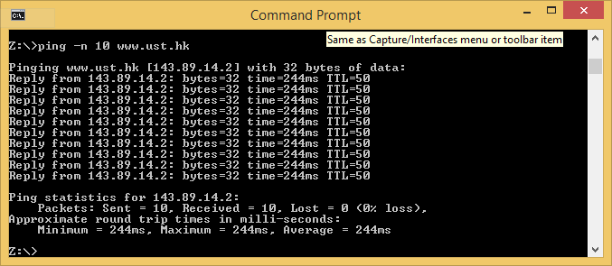

  

  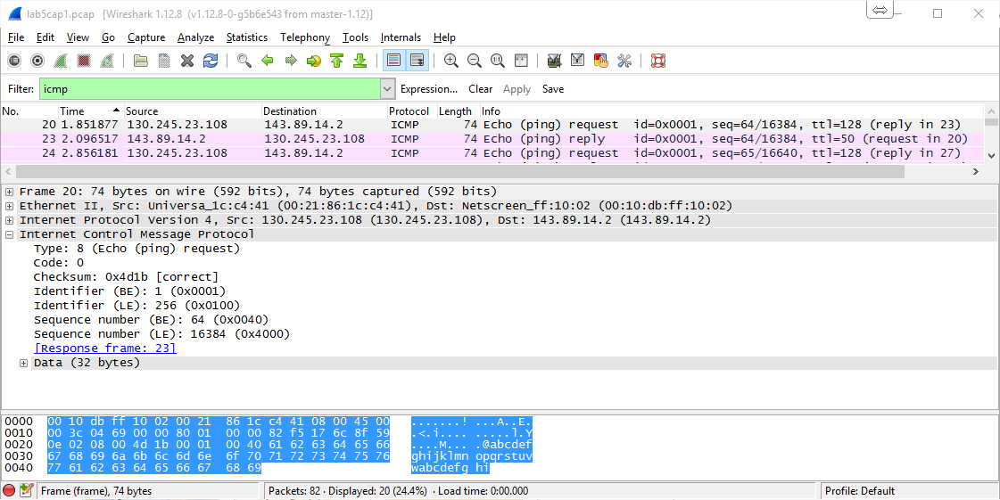   

  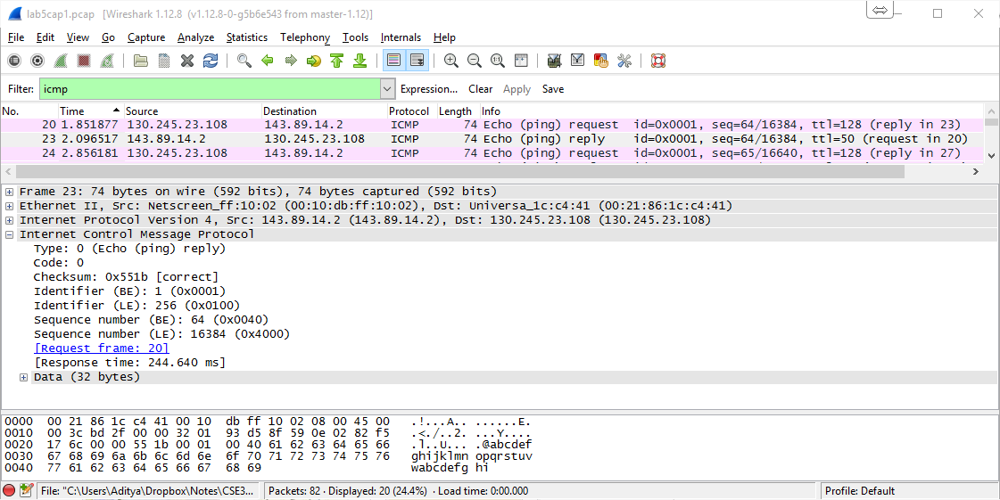

  

5. **What is the IP address of your host? What is the IP address of the target destination host?**

  My IP Address is 130.245.23.108. The IP address of the destination host is 128.93.162.84   

6. **If ICMP sent UDP packets instead (as in Unix/Linux), would the IP protocol number still be 01 for the probe packets? If not, what would it be?**

  No if ICMP sent UDP packets, the IP protocol number would then be 11   

7. **Examine the ICMP echo packet in your screenshot. Is this different from the ICMP ping query packets in the first half of this lab? If yes, how so?**

  The echo packet has the same fields as the query packet   

8. **Examine the ICMP error packet in your screenshot. It has more fields than the ICMP echo packet. What is included in those fields?**

  The error packet contains the IP header of the original packet and the original ICMP packet   

  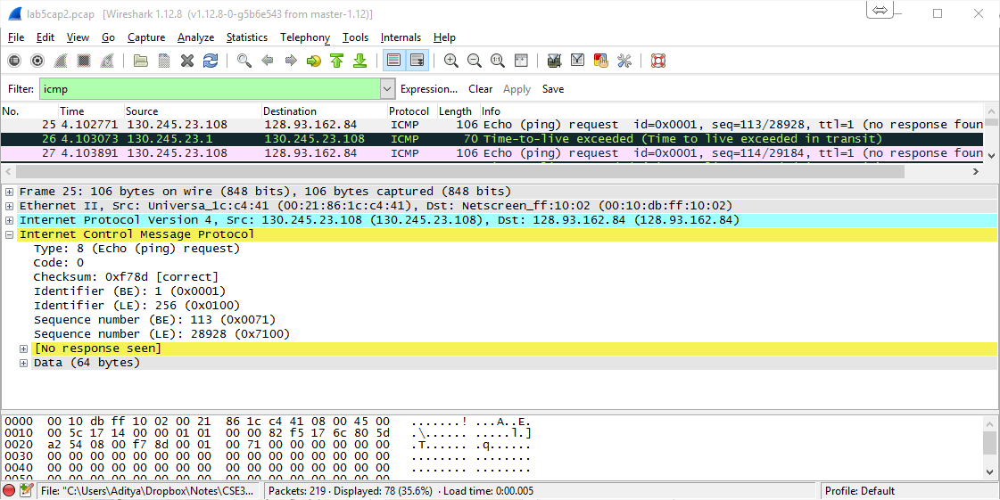

  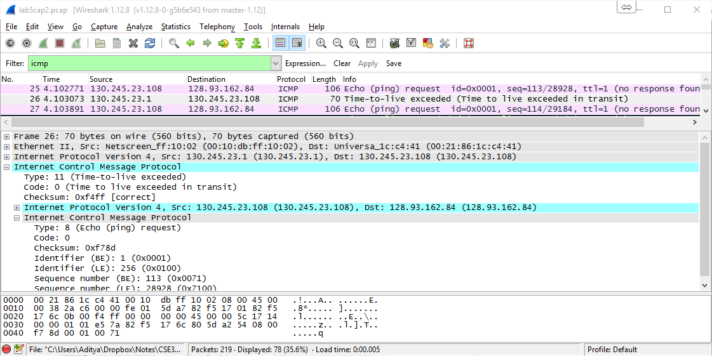   

9. **Examine the last three ICMP packets received by the source host. How are these packets different from the ICMP error packets? Why are they different?**

  The last 3 ICMP packets received are Ping replies (type 0) instead of TTL Expired (type 11) because the packets have made their way to the destination   

10. **Within the tracert measurements, is there a link whose delay is significantly longer than others? Refer to the screenshot in Figure 4, is there a link whose delay is significantly longer than others? On the basis of the router names, can you guess the location of the two routers on the end of this link?**

  Within the tracert measurements, the link between step 5 to 6 has a significantly longer delay than others.

  In figure 4, the link from step 9 to 10 has a delay significantly longer than others. This is the link from NYC to Pastourelle, France

  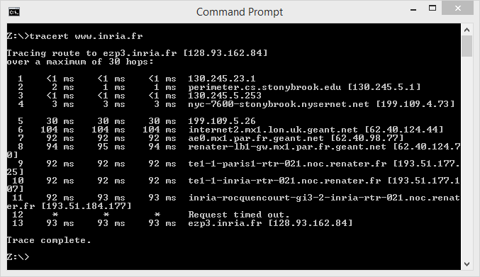

  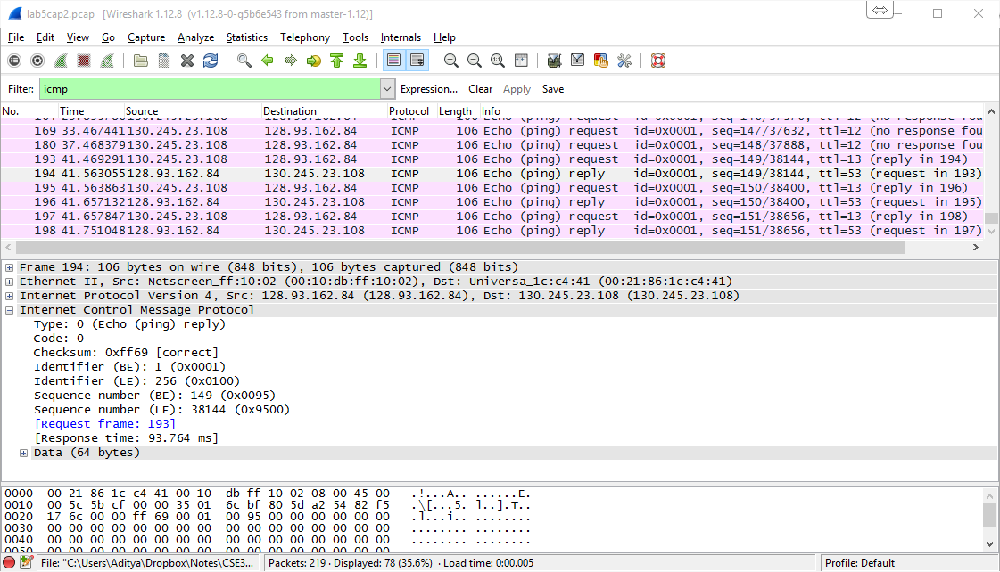   

### Part 2

1. **Go to http://ping.stonybrook.edu, where is this site? What are IP addresses and the Host Name displayed for your computer?**

    The site is in Stony Brook, NY.

    My IP, as displayed on the website is 130.245.68.25 and my hostname is not resolved

    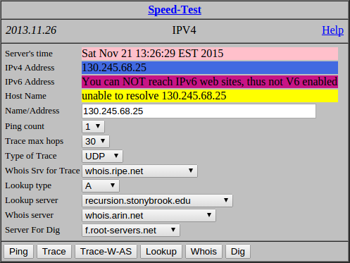

2. **Use the “Ping” service on http://ping.stonybrook.edu, find the approximate round trip times (RTT) to a university on the east coast, a  university on the west coast, a university in Europe, and a university in Asia respectively. What trend can you observe from these RTTs?**

    * East coast: Stony Brook university. Time : 0.257ms

      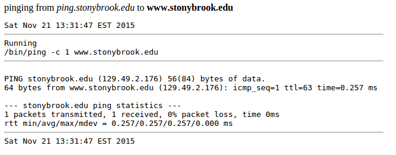

    * East coast: UCLA. Time : 0.100ms

      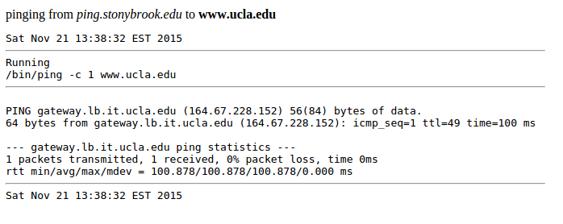

    * East coast: Cambridge University. Time : 0.108ms

      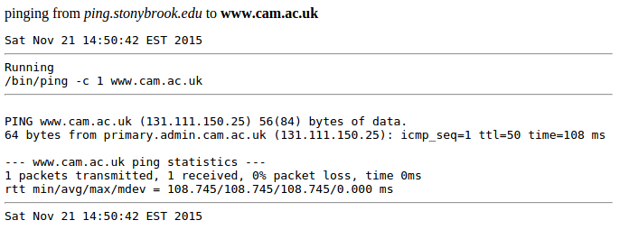

    * East coast: National University of Singapore. Time : 0.298ms

      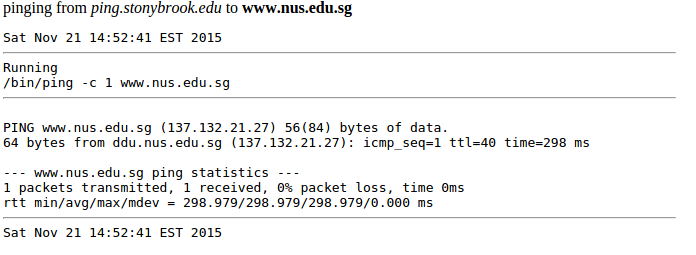

3. **Use the “Trace” service on http://ping.stonybrook.edu, trace a route to a university in the Netherlands, is there a link whose delay is significantly longer than others? Can you guess the
location of the two routers on the end of this link? (2pts)**

    Yes, the link from step 4 to 5 has a delay much larger than the array. The IP at step 4 is located in NY, while the one on step 5 is in UK which is why the delay is long

    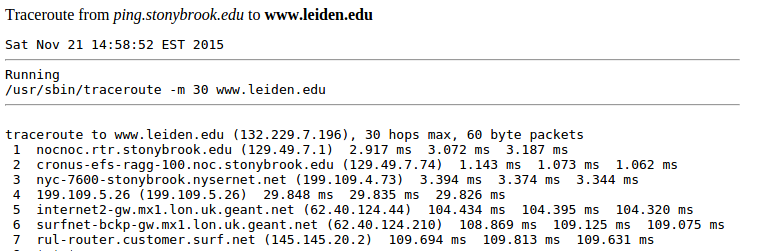

4. **Now trace a university in Australia instead of Holland. What can you find out?**

    Yes, the link from step 10 to 11 has a delay much larger than the array. The IP at step 4 is located in Pacific, while the one is in Australia.

    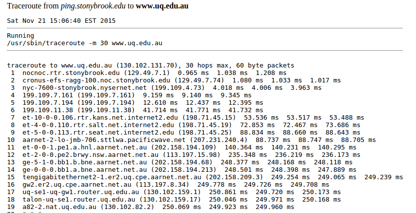

### Part 3

1. **Go to http://www.slac.stanford.edu/cgi-bin/nph-traceroute.pl?target=ping.stonybrook.edu, where is this site? Why?**

    This site is located in Stamford univesity.

2. **Repeat Question 2, Parts (c) and (d). What observations can you make about the routes taken?
E.g., can you guess where intermediate hops are? (3pts)**

    * Leiden univesity

      The link from step 13 to 14 has a much longer delay

      The intermediate stops are in Denver, Washington, Chicago and kansas

      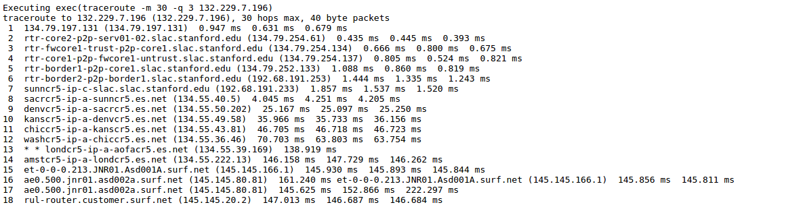

    * Universtiy of Queensland

      The link from step 7 to 8 has a much longer delay.

      The intermediate stops are in the Pacific

      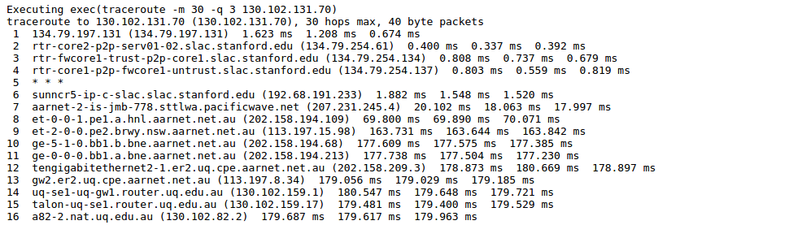
